# Governance & Voting Mechanisms

## Overview
Bananana operates on a **community-driven governance model** where stakeholders and contributors have a **direct say in decision-making**. Governance ensures fairness, transparency, and sustainable growth while empowering **Very Important Bananas (VIBs) and token holders** to shape the future of the ecosystem.

---

## Governance Structure
Bananana governance follows a **tiered participation system**, allowing members to influence decisions based on **contributions, voting power, and stake holdings**.

### 1️⃣ Community Governance (Open Voting)
- **All token holders** can participate in general governance decisions.
- Voting is conducted on **proposals such as feature developments, project direction, and partnerships**.
- **Community Polls:** Used for **minor proposals** (feature updates, community opinions).
- **Weighted Voting:** Used for **funding proposals and governance decisions**.
- **Quadratic Voting:** Used for **major changes (e.g., partnerships, economic policies)**.
- **VIB Council Votes:** Used for **elections, treasury allocations, and high-level strategy**.

### 2️⃣ VIB Council (Decision-Makers)
- **VIBs are the core contributors** with an elevated role in governance.
- **VIBs can submit proposals** and influence major changes.
- VIB status is **earned through contributions and is voted upon by the community**.

### 3️⃣ VIB Oversight Committee (Final Approval)
- **VIB Oversight Committee** oversee high-level governance.
- Ensures that decisions align with **project sustainability and long-term vision**.
- **Final review by the VIB Oversight Committee to ensure alignment with project goals, but all major changes require final community approval.**

---

## Proposal Vetting & Approval
1️⃣ **Proposal Submission** – Any VIB can submit a governance proposal.  
2️⃣ **Community Votes** – Community determines whether the proposal moves forward.  
3️⃣ **VIB Council Review** – Ensures feasibility, security, and alignment with ecosystem goals.  
4️⃣ **Final Oversight Review** – VIB Oversight Committee checks alignment but major decisions go to final community vote.  

```mermaid
graph TD;
    A[📝 Proposal Submission] -->|Any VIB submits a proposal| B[📊 Community Votes];
    B -->|Approved| C[🔍 VIB Council Review];
    B -->|Rejected| X[❌ Proposal Ends];

    C -->|Passes Review| D[✅ Final Oversight Review];
    C -->|Rejected| X;

    D -->|Major Decisions| E[🗳️ Final Community Vote];
    D -->|Minor Approval| F[✔️ Proposal Implemented];

    E -->|Approved| F;
    E -->|Rejected| X;
```

---

## Treasury & Fund Allocation
The Bananana ecosystem maintains **financial transparency** by allowing community-driven oversight of treasury funds.

### 🏦 Treasury Management
- **A portion of tokenomics is reserved for governance-controlled spending**.
- Funds are allocated based on **voting decisions from VIBs and token holders**.
- Regular **financial reports are published for community transparency**.
- **Liquidity & Stability:** Managed by the **Hybrid AI Treasury System with oversight from the VIB Council and community voting.**

### 📑 Allocation Strategy
| Category | Allocation Method |
|------------|----------------|
| Development & Upgrades | Community & VIB voting approval |
| Marketing & Outreach | Performance-based allocation with periodic voting review |
| Community Rewards | Automatically distributed via smart contracts |
| Liquidity & Stability | Managed by the Hybrid AI Treasury System with oversight from the VIB Council and community voting |

---

## Future of Bananana Governance
Bananana governance will evolve with **progressive decentralization**, transitioning more decision-making power to the **community and VIB council**.

By maintaining a **balanced governance structure**, $BANANANA ensures **long-term sustainability, fairness, and an engaged community**. 🚀🍌
