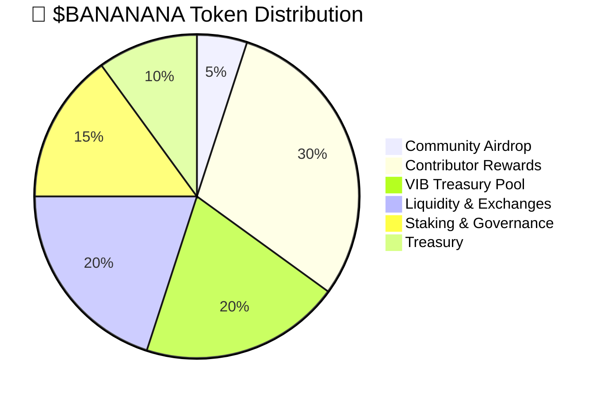

# Tokenomics & Economy Structure

## Overview
The **Bananana ecosystem** is designed to be **sustainable, rewarding, and engaging** by ensuring fair token distribution, a structured reward system, and long-term economic viability. By implementing a strategic vesting schedule and staking model, we aim to protect investors, contributors, and the broader community while ensuring the sustainability and utility of the token.

This document outlines the complete allocation of the $BANANANA token, including vesting schedules, staking benefits, earning methods, circulation strategies, and the larger vision for the project.

---

## Total Supply & Distribution

#### **Total Token Supply**: 1,000,000,000,000 $BANANANA  

---

## Vesting & Locking Mechanisms  
To ensure **price stability** and **prioritize long-term supporters**, certain allocations will be **locked and released gradually** based on a structured vesting schedule.  

### 📊 Vesting Breakdown  

| **Group**               | **Tokens Allocated** | **Vesting Period**         | **Release Schedule**  |
|------------------------|------------------|------------------------|------------------------|
| **VIB Treasury Pool**  | 20% of supply   | Long-term dynamic release | Allocated based on contribution and governance decisions. VIBs receive benefits before contributors. |
| **Contributors**       | 30% of supply   | 18 months               | Unlocks 4% every month after a 3-month cliff. |
| **Airdrop Recipients** | 5% of supply    | 12 months               | Unlocks 25% every 3 months. |
| **Staking & Governance** | 15% of supply  | Ongoing                 | Distributed based on staking participation. |
| **Treasury**           | 10% of supply   | Reserved                | Used for future strategic growth. |

### 🔑 Why Vesting Matters  
✔ **VIBs receive priority benefits** – Long-term supporters are rewarded first.  
✔ **Prevents market manipulation** – Controlled releases avoid sudden price drops.  
✔ **Encourages long-term commitment** – Aligns incentives with project growth.  
✔ **Gradual token integration** – Ensures balanced liquidity and stable market conditions.  
✔ **Supports sustainable tokenomics** – Strengthens $BANANANA’s long-term value.  

---

## Staking Benefits & Governance Participation

#### Staking Rewards Model

| **Stake Duration** | **APY (Annual % Yield)** | **Extra Rewards** |
|-----------------|----------------|----------------|
| **30 Days** | 5% | None |
| **90 Days** | 10% | 5% Bonus Rewards |
| **180 Days** | 15% | Exclusive NFT Airdrop |
| **365 Days** | 20% | Extra DAO voting power + VIB Merch Access |

## Revenue Allocation Strategy  
The revenue generated from **Bananana’s ecosystem** will primarily come from **off-chain sources**, such as brand partnerships, merchandise sales, advertising, and other external revenue streams. This revenue will be strategically allocated to ensure **fairness, growth, and sustainability**.  

The goal is to **reward contributors**, **expand the brand**, and **fund development**, while also **partially reinvesting into the $BANANANA token** to boost its value as the ecosystem grows. This ensures a **balanced approach** where revenue fuels expansion while also strengthening the token’s market position.  

#### **1️⃣ Token Reinvestment – 20%**  
- 20% of the revenue will be **reinvested into the $BANANANA token**.  
- This increases **liquidity** and **value**, benefiting holders, contributors, and stakeholders.  
- Helps stabilize and grow the token’s **market presence**.  

#### **2️⃣ VIB Revenue Rewards – 20%**  
- Only the **Top 10% of VIBs** will receive **revenue rewards**.  
- These **key contributors** helped ignite the brand and will continue to benefit.  
- Rewards will be **scaled based on contribution level** to ensure fairness.  

#### **3️⃣ Growth & Expansion – 25%**  
- This portion will be used for:  
  - **Brand expansion** (mainstream media, partnerships, licensing).  
  - **Marketing & awareness** (advertising, social media, influencer campaigns).  
  - **Operational growth** (new initiatives, platform development).  

#### **4️⃣ Reserved for Strategic Investors – 10%**  
- Reserved **for investors who fund off-chain expansion** (e.g., merchandising, media, and partnerships).  
- Creates **an attractive investment opportunity** while keeping the DAO structure intact.  
- Ensures **investors see direct returns from the business’s success**.  

#### **5️⃣ Outsourced Development & Services – 10%**  
- Funds **game updates, animation production, and blockchain security**.  
- Covers **outsourced developers, designers, animators, and specialists** on a contract basis.  
- Ensures **high-quality work while maintaining flexibility and cost efficiency**.  

#### **6️⃣ Operational & Development Costs – 7%**  
- Covers **server costs, infrastructure, and software maintenance**.  
- Funds **new platform features, technology upgrades, and ongoing development**.  

#### **7️⃣ Legal & Compliance – 3%**  
- Covers **legal fees, audits, and regulatory compliance**.  
- Ensures smooth operation within **crypto regulations** to maintain legitimacy.  

#### **8️⃣ Reserve & Emergency Fund – 5%**  
- Provides **financial security** for unforeseen challenges.  
- Can be used for **future pivots, crisis management, or strategic investments**.  

### 🌍 Ecosystem Revenue
As **Bananana grows in popularity**, we will generate revenue through multiple streams:
- **YouTube Ads & Content Monetization**
- **Sponsored Brand Deals**
- **Merchandise Sales**
- **Game Partnerships & In-App Purchases**

### 💹 Ideal for Investors & Growth  
✔ **Strategic Investor Incentives** – A **reserved 10% ensures investors can earn from off-chain growth** while keeping the token decentralized.  
✔ **Strong Token Growth** – 20% reinvestment **boosts token value and liquidity** without excessive inflation.  
✔ **Sustainable & Scalable** – Balanced growth, operational funding, and a reserve fund **ensure long-term success**.  
✔ **Fair & Community-Driven** – The **top 10% of VIBs still receive revenue rewards** without overburdening finances.  
✔ **Flexible Development** – **Outsourced teams keep costs low** while allowing rapid expansion.  

### 🛍️ VIB Merch Access
VIB Merch Access is a **premium membership benefit** exclusive to **top stakers and VIB holders**. It includes:
- **Limited-Edition $BANANANA Merchandise** – Special clothing, accessories, and collectibles.
- **Early Access to New Drops** – Priority access to merchandise and NFTs.
- **Customization & Exclusive Items** – Ability to request **customized merch** for top supporters.

---

## Security Measures & Future Growth
- **Multi-Sig Treasury Protection:** The Bananana Treasury is secured via **multi-signature wallets**, ensuring decentralized fund management.
- **Liquidity Management:** 20% is allocated to prevent sudden price volatility.
- **Marketing & Expansion Plan:** 25% of revenue is used for partnerships, branding, and scaling.
- **Burn Mechanism:** Periodic token burns to increase scarcity.

By maintaining **a fair, community-driven economy**, $BANANANA ensures long-term sustainability and growth. 🚀🍌

